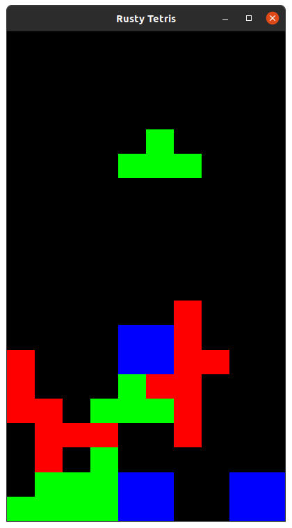
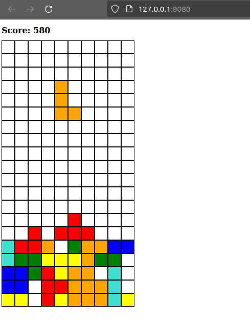

rusty_tetris
------------

A Test Driven, Rust implementation of the classic Tetris game.

Native Implementation (Blue Engine)
===================================

Controls:
* Left / Right / Down Arrow to move
* Left Ctrl/Control to rotate current shape
* Space to drop current shape

Web Implementation (Leptos)
==========================

Controls:
* (A Key) Move Left
* (D Key) Move Left
* (S Key) Move Down
* (Space) Rotation
* (Enter) Drop

Run tests: `cargo test`

Run Native Implementation: `cargo run --bin native`
Run Web Implementation `trunk serve`
